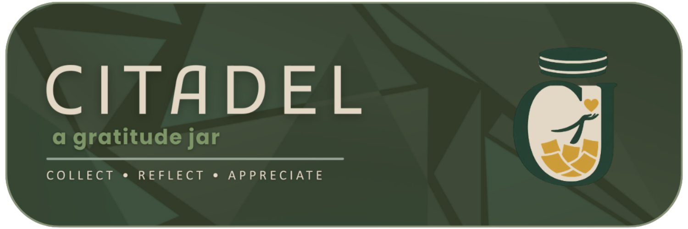

<p align="center">
  
</p>

<p align="center">
  <i>"Small reflections lead to meaningful growth."</i>
</p>

<p align="center">
  
  
  
  
</p>

<p align="center">
  
  
  
</p>

<br>

> ⭐ *If CITADEL resonates with you, give us a star — it means the world to the team.*

Most journaling apps don't fail on features. They fail on **habit, meaning, and emotional connection**. CITADEL was built to fix that — a mobile journaling space that doesn't just store entries, but helps you *rediscover* them through a gratitude jar, *understand* them through mood analytics, and *sustain* them through a streak system.

Named after a stronghold of inner resilience, **CITADEL is your personal fortress of reflection**.

---

## Table of Contents

- [The Problem We're Solving](#the-problem-were-solving)
- [What is CITADEL](#what-is-citadel)
- [Getting Started](#getting-started)
- [Architecture](#architecture)
- [Features](#features)
- [Application Flow](#application-flow)
- [Tech Stack](#tech-stack)
- [UML Design](#uml-design)
- [Roadmap](#roadmap)
- [Development Team](#development-team)

> **Note:** Full setup documentation and module-level guides are available in the project Wiki.

---

## The Problem We're Solving

Most people *want* to journal. Very few keep at it. The gap isn't motivation — it's structure, feedback, and rediscovery.

Here's what CITADEL addresses:

-  Journaling feels like a chore with no reward loop
-  Past memories get buried and forgotten over time
-  Mood shifts go unnoticed without visual patterns to reference
-  Habit-building has no system to fall back on

> 💡 CITADEL tackles all four — not as separate tools, but as one cohesive emotional ecosystem.

---

## What is CITADEL

CITADEL is a **modular mobile journaling prototype** designed around emotional awareness and reflective thinking. At its heart is the **Gratitude Jar** — a digital vessel that stores your best moments and surfaces them when you need them most.

### Entry Types

Every memory deserves the right container. CITADEL supports four:

| Type | Purpose |
|------|---------|
| 🌱 **Milestone** | Mark achievements and turning points in your journey |
| 💬 **Quote** | Capture words that moved you |
| 📸 **Memory** | Preserve vivid moments before they fade |
| 📝 **Journal** | Free-form daily reflections, unfiltered |

---

## Getting Started

### What You Need

- [.NET 10 SDK](https://dotnet.microsoft.com/)
- Visual Studio 2022
- NuGet package restore enabled (automatic)

### Running the App

**Open the solution:**
```bash
C:\Users\Admin\source\repos\GratitudeJar\GratitudeJar.slnx
```

**Build and run:**
```
Press F5   OR   click ▶ Run
```

**What happens under the hood:**
```
 NuGet packages restore automatically
 Roslyn compiles the project
 Local dev server starts
 You land on the Login / Register screen
```

> No additional configuration needed. CITADEL is fully self-contained and works offline out of the box.

---

## Architecture

CITADEL follows a **modular component-based architecture** — each feature lives in its own isolated module, communicating through a shared navigation layer rather than directly calling each other.

### Module Responsibilities

| Module | What It Does | Status |
|--------|-------------|--------|
| 📖 Journal Module | Full CRUD for entries, timeline organization | ✅ Core |
| 🫙 Gratitude Jar Module | Shake mechanic, random entry retrieval | ✅ Core |
| 😊 Mood Analytics Module | Mood input, trend charts, pattern detection | ✅ Core |
| 🔥 Streak System Module | Daily activity logging, streak counters | ✅ Core |
| 👤 Profile Module | User info, stats summary, settings | ✅ Core |
| 🗄️ SQLite Data Layer | Local persistence, offline-first storage | ✅ Always |

### System Overview

```
┌──────────────────────────────────────────────┐
│              CITADEL Application             │
│  (ASP.NET Core + Blazor Component Framework) │
├──────────┬───────────┬──────────┬────────────┤
│  Journal │ Gratitude │  Mood    │  Streak    │
│  Module  │    Jar    │ Analytics│   System   │
├──────────┴───────────┴──────────┴────────────┤
│              Unified Navigation              │
├──────────────────────────────────────────────┤
│          SQLite Local Data Layer             │
└──────────────────────────────────────────────┘
```

Each module exposes clean service interfaces — business logic never bleeds into the UI layer, and the data layer remains the single source of truth.

---

## Features

### 🫙 Gratitude Jar

The heart of CITADEL. A digital jar that holds your most meaningful entries and hands them back to you at random — like rediscovering a forgotten note in your pocket.

- Shake gesture triggers a random memory retrieval
- Surfaces entries from any type: milestones, quotes, memories, or journals
- Designed to spark nostalgia and reinforce gratitude through surprise

### 📖 Journal System

A clean, structured space for every kind of reflection.

- Create entries across four types (Milestone, Quote, Memory, Journal)
- Edit and update any entry at any time
- Delete entries you've outgrown
- Chronological timeline keeps your story organized

### 😊 Mood Analytics

Your emotional history, made visible.

- Log your mood with each journal session
- Trend visualization reveals patterns you might not notice day to day
- Historical sentiment overview gives a bigger picture of your emotional arc

### 🔥 Streak System

Consistency made rewarding, not stressful.

- Tracks daily journaling activity automatically
- Streak counters build momentum over time
- Positive feedback loop encourages you to keep going — not guilt you when you stop

### 👤 Profile Module

Your journaling identity in one place.

- Personal dashboard with your name, stats, and activity history
- Current streak and total entry count at a glance
- Profile management for preferences and user info

---

## Application Flow

```
🔐 Login / Register
        ↓
🏠 Dashboard
        ↓
  ┌──────────┬─────────┬────────────┬───────────┐
    😊 Mood   🫙 Jar   📖 Entries  👤 Profile
  └──────────┴─────────┴────────────┴───────────┘
        ↓
  📝 Write or revisit an entry
        ↓
  😊 Mood trend updates
        ↓
  🔥 Streak increments
```

---

## Tech Stack

<div align="center">

| Layer | Technology | Why We Chose It |
|-------|-----------|----------------|
| **UI Framework** | Blazor (.NET 10) | Component-based, C#-native, perfect for our modular architecture |
| **Core Logic** | C++ | Handles journaling, mood computation, and streak tracking at speed |
| **Web Backend** | ASP.NET Core | Routing, DI, and app structure without the bloat |
| **Database** | SQLite | Embedded, offline-first, zero configuration needed |
| **IDE** | Visual Studio 2022 | Full debugging and NuGet integration out of the box |
| **Design** | Figma | Where every screen started before a line of code was written |

</div>

---

## UML Design

<p align="center">
  
</p>

---

## Roadmap

CITADEL is a prototype with a clear vision for what comes next.

**Near-term:**
- Cloud sync — optional backup and cross-device access
- Entry export — PDF or Markdown download of your journal
- Dark mode — full theme support across all modules

**Longer-term vision:**
- AI-assisted reflection prompts based on past entries
- Weekly and monthly mood summary reports
- Multi-language support
- Wearable integration for passive mood logging

> 💡 Have an idea? Open an issue or start a discussion — the roadmap is shaped by the people who use it.

---

## Development Team

<table>
  <tr>
    <th>👨‍💻 Name</th>
    <th>🧩 Role</th>
    <th>📧 Contact</th>
  </tr>
  <tr>
    <td><b>Fernandez, John Rommel P.</b></td>
    <td>Project Manager / Lead Developer</td>
    <td>24-07945@g.batstate-u.edu.ph</td>
  </tr>
  <tr>
    <td><b>Magbuhat, Julian Carlo C.</b></td>
    <td>UI / UX Developer</td>
    <td>24-01351@g.batstate-u.edu.ph</td>
  </tr>
  <tr>
    <td><b>Apolinar, Jev Austin A.</b></td>
    <td>Logic Developer / QA Tester</td>
    <td>24-06667@g.batstate-u.edu.ph</td>
  </tr>
</table>

---

<p align="center">
  <b>"CITADEL is not just an app — it is a reflection of growth, gratitude, and human experience."</b>
  <br><br>
  Built with intention &nbsp;·&nbsp; Designed for reflection &nbsp;·&nbsp; Engineered for growth
</p>
